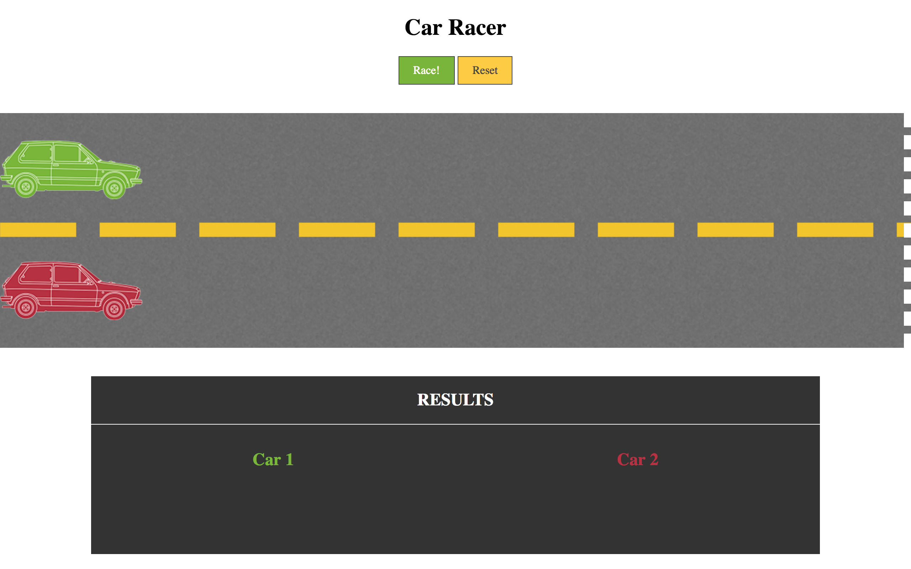
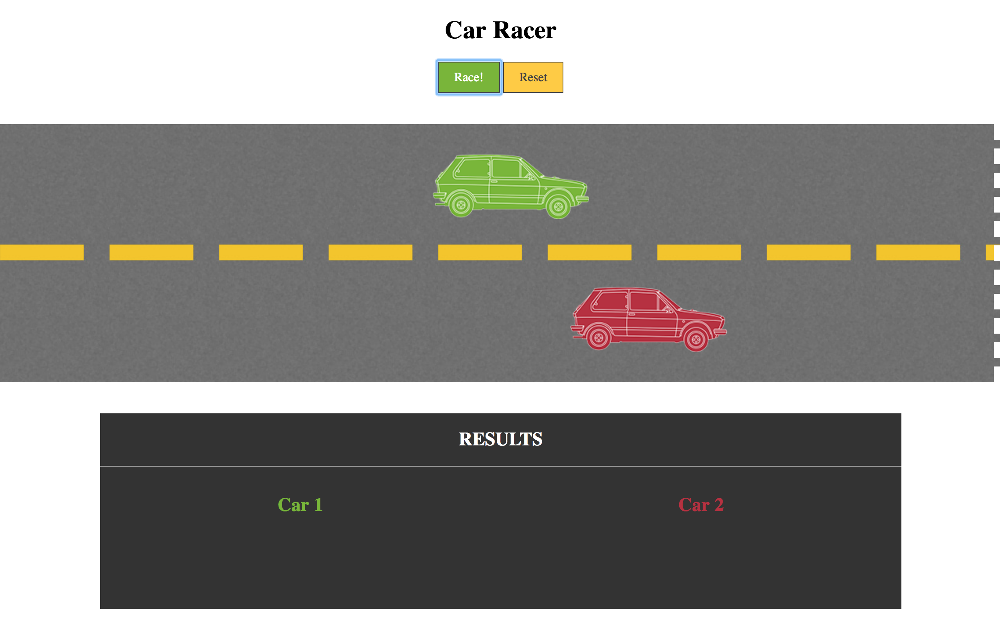
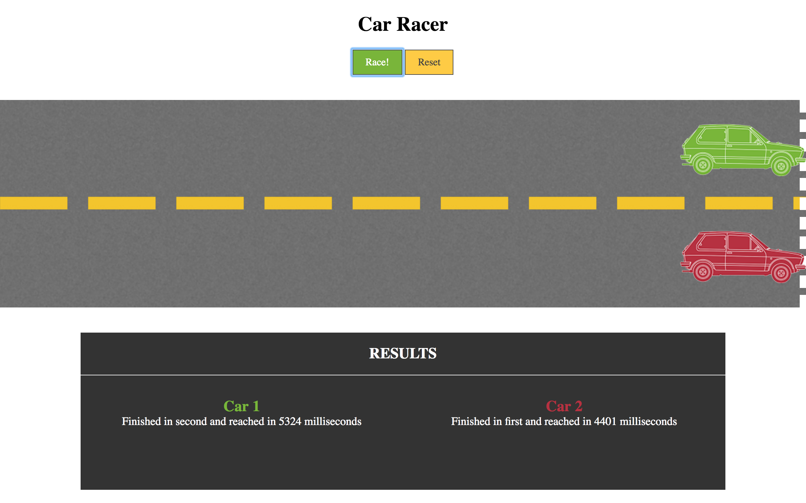

# Car-Racer
User will be able to do race for 2 cars and also see the time in which 2 car's reach the destination.

## Prerequisites
Yarn or npm

## Getting Started
Download the files, run npm or yarn install, it will install the dependencies. Once dependencies are installed run gulp watch to start browserify,
you can then make changes to files in src and see the compiled code in dist files

## Screenshots
 

## Built With
  - [Gulp.js](https://gulpjs.com/) - The task manager
  - [Yarn](https://yarnpkg.com/en/) - The package manager
  - [Webpack](https://webpack.js.org/) - The module bundler
  - [Babel](https://webpack.js.org/) - The compiler to write latest JavaScript
